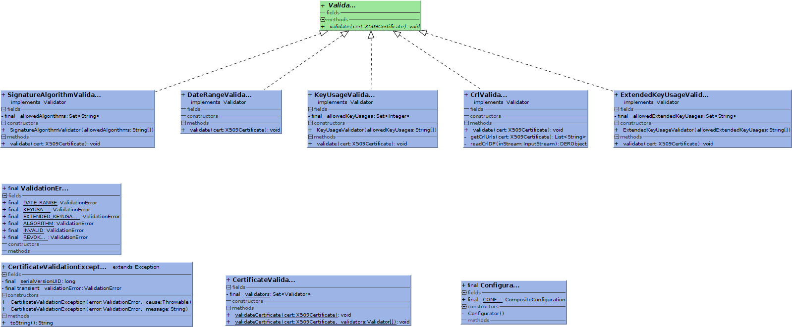

pki-validation
==============

Defines validators to check the validity of certificates

- DateRange checker
- KeyUsage checker
- ExtendedKeyUsage checker
- SignatureAlgorithm checker
- CRL checker

